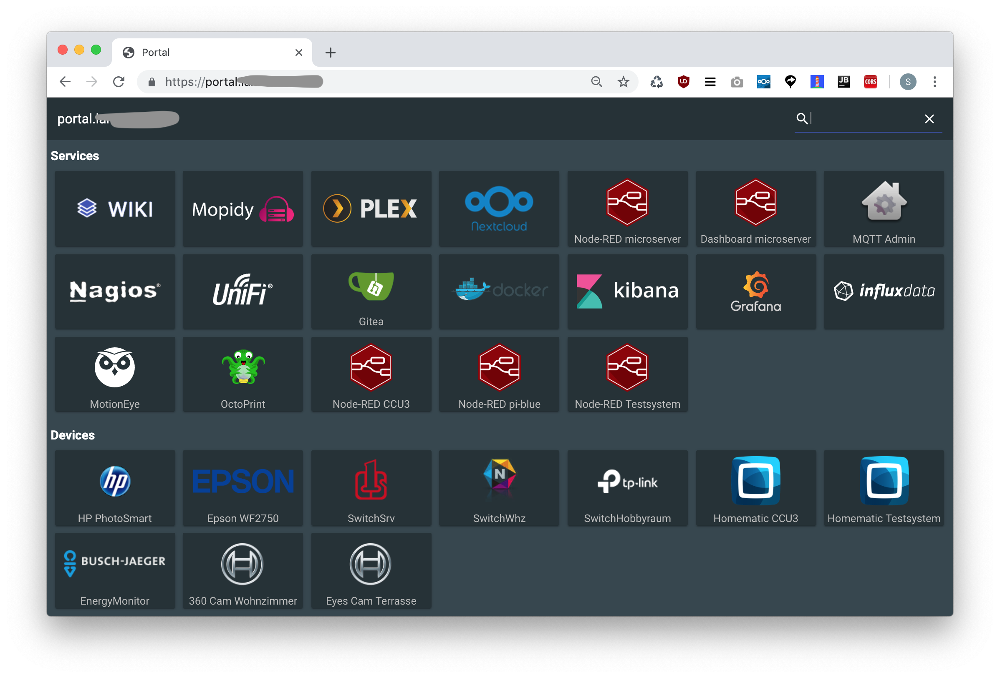

# nice-portal

> dead simple - but nice - portal webpage 🏰

I wanted a nice looking webpage with _working keyboard navigation_ as a “portal” to the services of my home network - so I created this. :-)

## Install

Download the latest `nice-portal-<version>.tar.gz` from the [release page](https://github.com/hobbyquaker/nice-portal/releases/latest), unzip and put on a webserver (opening locally from a `file://` URL will fail due to CORS).
Edit the `config.json` file to suite your needs, that's all.

## Contributing

Pull requests welcome! 😊    
Clone the Repo, do `npm install`, use `polymer serve` for development. Please run `npm test` before committing, most lint issues can be auto-corrected with `npm run lintfix`.

## License

MIT (c) Sebastian Raff

